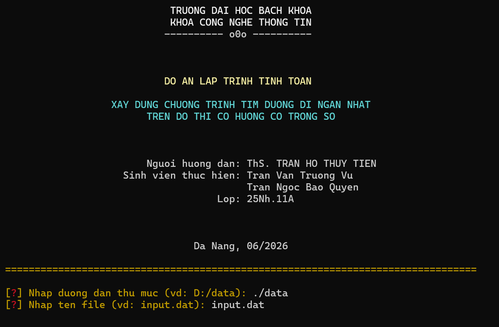

<div align="center">
  <h1>🚀 Mô Phỏng Thuật Toán Dijkstra Trực Quan</h1>
  <p><b>Đồ án Học phần Lập trình Tính toán (PBL1)</b><br>Trường Đại học Bách Khoa - ĐHĐN</p>
</div>

---

## 📖 Giới thiệu
Dự án này là một ứng dụng mô phỏng trực quan từng bước thuật toán Dijkstra để tìm đường đi ngắn nhất trên đồ thị có hướng và có trọng số. 

Ứng dụng giúp người dùng dễ dàng quan sát cách thuật toán duyệt qua các đỉnh, cập nhật khoảng cách và tìm ra đường đi tối ưu nhất thông qua giao diện đồ họa sống động.

- **Ngôn ngữ lập trình:** C/C++
- **Thư viện đồ họa:** [Raylib](https://www.raylib.com/)

---

## ✨ Tính năng nổi bật
- **Mô phỏng trực quan, sinh động:** Hiển thị chi tiết từng bước thuật toán, quá trình cập nhật khoảng cách giữa các đỉnh.
- **Tối ưu hóa bằng Min-Heap:** Sử dụng cấu trúc Hàng đợi ưu tiên (Priority Queue / Min-Heap) để tối ưu tốc độ xử lý của thuật toán.
- **Vẽ đồ thị tự động:** Đọc thông tin từ file dữ liệu đầu vào và tự động bố trí các đỉnh dàn đều theo hình tròn.
- **Nhật ký hệ thống (Log):** Bảng trạng thái chi tiết hiển thị bên phải màn hình giúp theo dõi lịch sử xử lý.
- **Hệ thống màu sắc dễ nhận biết:**
  - 🟠 **Màu Cam:** Đỉnh xuất phát.
  - 🟡 **Màu Vàng:** Đỉnh đang được xét.
  - 🟢 **Màu Xanh lá:** Đỉnh đã xác định được khoảng cách ngắn nhất.
  - 🔴 **Màu Đỏ:** Đường đi ngắn nhất cuối cùng.

---

## 🖼️ Hình ảnh minh họa
*(Giao diện Console khi khởi chạy chương trình)*



---

## 🎮 Hướng dẫn sử dụng (Phím tắt)
Bạn có thể tương tác với chương trình bằng các phím tắt sau:
- <kbd>SPACE</kbd> : Bắt đầu chạy mô phỏng thuật toán.
- <kbd>R</kbd> : Làm mới (Reset) đồ thị về trạng thái ban đầu.
- <kbd>N</kbd> : Đóng giao diện đồ họa hiện tại để nhập file dữ liệu đồ thị mới từ Console.
- <kbd>ESC</kbd> : Thoát chương trình.

---

## ⚙️ Cài đặt & Khởi chạy

### 1. Yêu cầu hệ thống
- Trình biên dịch **C/C++** (GCC/MinGW cho Windows).
- Thư viện đồ họa **Raylib** (đã được cấu hình).
- Lệnh `make` (sử dụng `mingw32-make` đối với Windows).

### 2. Biên dịch và chạy chương trình
Mở Terminal hoặc Command Prompt tại thư mục gốc của dự án và chạy các lệnh dưới đây.

**Bước 1: Biên dịch chương trình**
```bash
mingw32-make 
# Hoặc sử dụng lệnh sau nếu máy bạn hỗ trợ:
# make
```

**Bước 2: Khởi chạy**
Sau khi biên dịch thành công, chạy file thực thi:
```bash
./game
```
